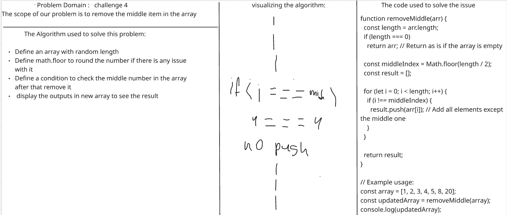
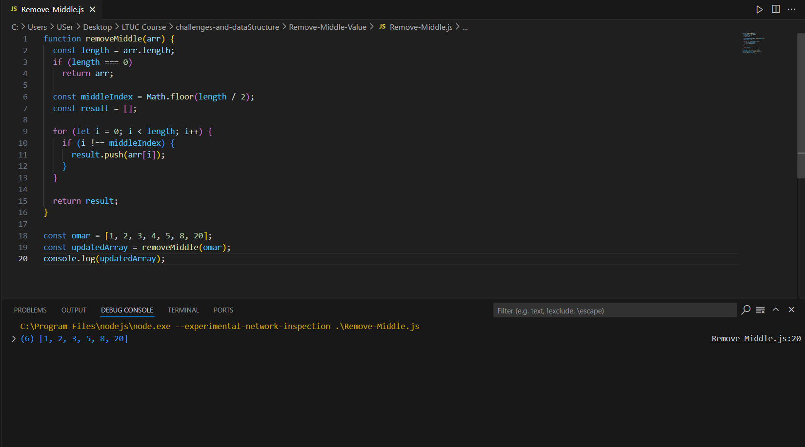

# challenges-and-dataStructure

# Challenge Name: Remove the middile item in the array
* the scope for this is to remove the middle item with random array.

* And here we can find the code used to solve the issue:

