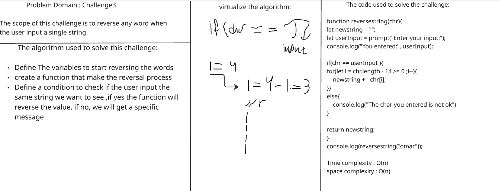
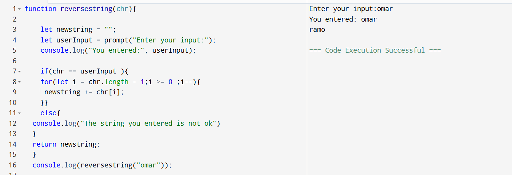

# challenges-and-dataStructure
# Challenge Name : Reverse Characters
- The scope of this challenge is the reverse any word if the user input a string

 

- Here we can see the code working correctly:

